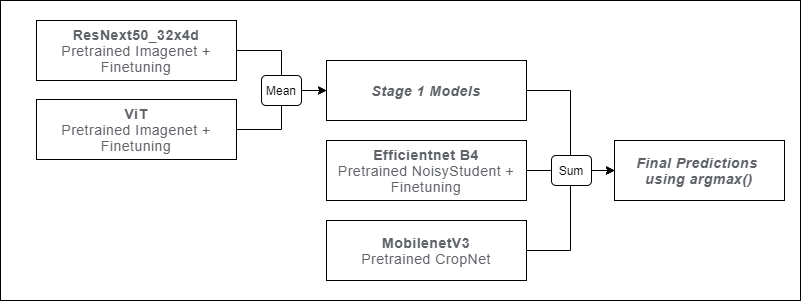

## Link to the competition: [Casava Leaf Disease Classification](https://www.kaggle.com/c/cassava-leaf-disease-classification)
## Top-1 Solution
* Overall strategy: test as many models as possible and spend less time on fine-tuning -> have many diverse models for ensembling.
* Variety of different architectures: EfficientNet, ResNet, ResNext, Xception, ViT, DeiT, Inception and MobileNet.
* Ensemble:

* Key: using CropNet from Tensorflow Hub, as it brought a lot of diversity to our ensemble.
* Augmentations (from the Albumentations Python library): RandomResizedCrop, Transpose, HorizontalFlip, VerticalFlip, ShiftScaleRotate, Normalize.
* 5-fold-CV with 15 epochs (after the 15 training epochs, we always chose the model with the best validation accuracy) (same data partitioning as for the other trained models)

## Notebooks
1. [Training ResNeXt50](https://www.kaggle.com/hiarsl/cassava-leaf-disease-resnext50)
2. [Training ViT TPU](https://www.kaggle.com/sebastiangnther/cassava-leaf-disease-vit-tpu-training)
3. [Training EfficientNetB4](https://www.kaggle.com/jannish/cassava-leaf-disease-efficientnetb4-tpu)
4. [Inference](https://www.kaggle.com/jannish/final-version-inference)